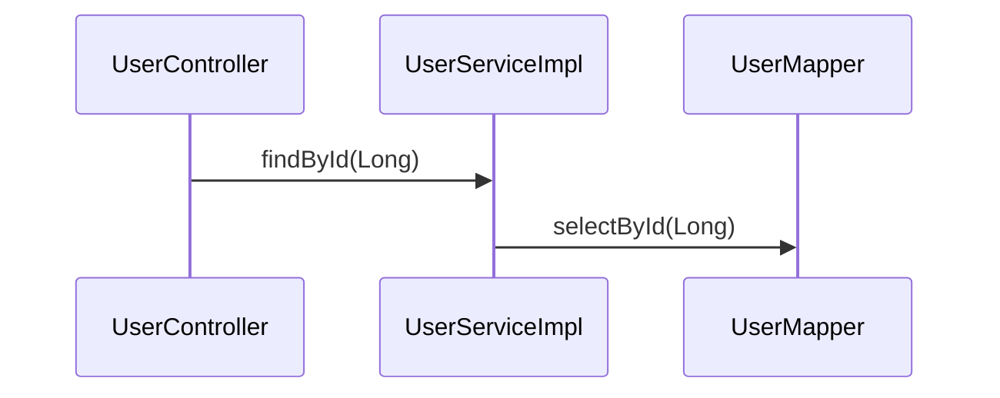
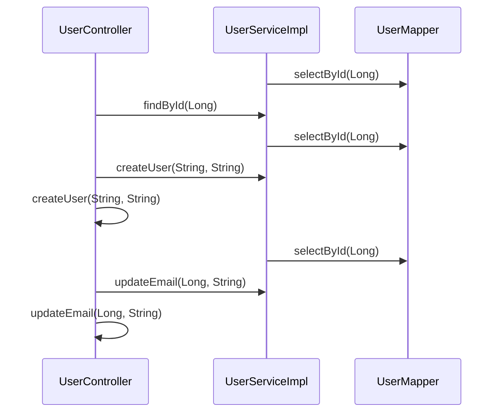
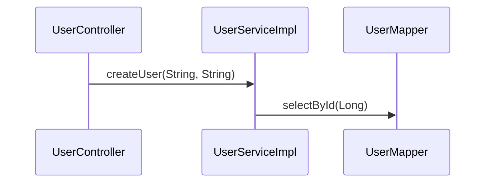
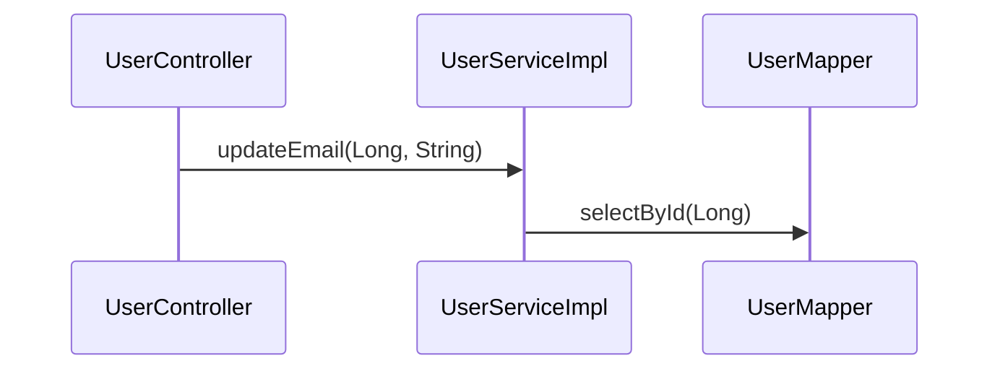
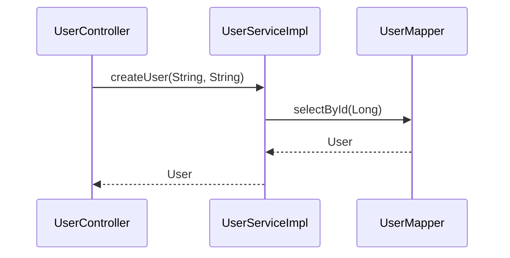
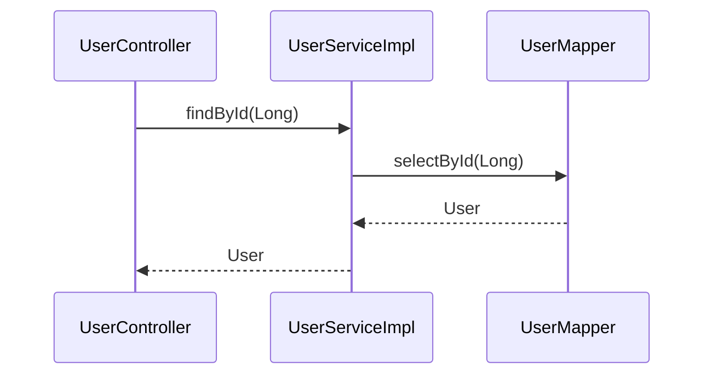

# Example

## Introduction

You can use this file to paste tool ouput for rendering by visual studio:

> `java -jar target/sourcelens.jar trace --entry "com.example.mapper.UserMapper#selectById(Long)"`

## UserController: createUser(String, String)

## UserController: updateEmail(Long, String)

## Feature 2.6

## 2.6 - UserController: createUser(String, String)

## 2.6 - UserController: getUser(Long)

## 2.6 - UserController: updateEmail(Long, String)

