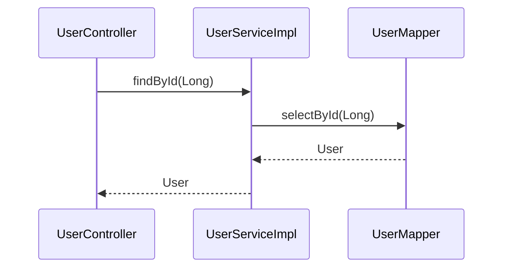

# auracode(1)

## NAME

**auracode** — static call-graph analysis and Mermaid sequence diagram generation for Java projects

## SYNOPSIS

```
auracode [--help] [--version] <command> [<args>]
```

```
auracode index   --source <dir>  [--db <file>] [--clean] [--yes] [--include-external]
auracode trace   --entry  <fqn>  [--db <file>] [--output <file>]
                                  [--depth <n>]  [--callers] [--split]
auracode render  [--input <file>] [--output <file>]
```

## DESCRIPTION

**auracode** parses Java source trees with a static analyser, builds a method-level
call graph, and produces Mermaid `sequenceDiagram` blocks that visualise call chains
and their return types.

The tool is composed of three independent commands that form a pipeline:

```
index  →  trace  →  render
```

Each command reads from and writes to files (or stdin/stdout), so the stages can be
run separately or chained with shell pipes.

## COMMANDS

---

### index

Walk a Java source tree, parse every `.java` file, and persist method-call edges to
a SQLite database.

```
auracode index --source <dir> [--db <file>] [--clean] [--yes] [--include-external]
```

**Options**

| Option | Short | Default | Description |
|--------|-------|---------|-------------|
| `--source <dir>` | `-s` | *(required)* | Root directory of the Java source tree to index. |
| `--db <file>` | `-d` | `.auracode.db` | SQLite output file. Created if it does not exist; updated incrementally if it does. |
| `--clean` | | false | Delete the existing database before indexing. Prompts for confirmation unless `--yes` is also given. |
| `--yes` | `-y` | false | Skip the `--clean` confirmation prompt. Intended for scripting and CI environments where no interactive console is available. |
| `--include-external` | | false | Include call edges to Java SDK and third-party libraries. By default these edges are suppressed so the call graph contains only project-internal method calls. |
| `--help` | `-h` | | Print command help and exit. |

**Notes**

- The tool parses source at **Java 8** language level for maximum compatibility with
  legacy codebases, but requires a **Java 17+** runtime to execute.
- Re-running `index` on the same `--db` is safe: nodes and edges are upserted, not
  duplicated.
- Use `--clean --yes` to force a full re-index in CI pipelines or pre-commit hooks
  without interactive prompts.
- Method return types are stored alongside each node and are used by `trace` to
  annotate the trace file (see Feature 2.6).

---

### trace

Query the call graph and emit an ordered, depth-first edge list from a given entry
point.

```
auracode trace --entry <fqn> [--db <file>] [--output <file>]
                              [--depth <n>]  [--callers] [--split]
```

**Options**

| Option | Short | Default | Description |
|--------|-------|---------|-------------|
| `--entry <fqn>` | `-e` | *(required)* | Fully-qualified entry-point method (see *FQN Format* below). |
| `--db <file>` | `-d` | `.auracode.db` | SQLite database produced by `index`. |
| `--output <file>` | `-o` | stdout | Write the edge list to a file instead of stdout. |
| `--depth <n>` | `-n` | `50` | Maximum DFS traversal depth. Prevents runaway traversal on cyclic graphs. |
| `--callers` | | false | **Inverse mode.** Trace all callers of `--entry` upward through the call graph instead of tracing callees downward. |
| `--split` | | false | Used with `--callers`. Partition the output into one section per independent root caller, each preceded by a `=== <fqn> ===` header. |
| `--help` | `-h` | | Print command help and exit. |

**Trace file format**

Each line is a directed call edge:

```
com.example.controller.UserController#getUser(Long) -> com.example.service.UserServiceImpl#findById(Long) : User
com.example.service.UserServiceImpl#findById(Long) -> com.example.mapper.UserMapper#selectById(Long) : User
```

The optional ` : ReturnType` suffix carries the callee's return type as stored in the
database. It is omitted when the return type is unknown (e.g. calls into external
libraries). The suffix is backward compatible — `render` treats its absence as
`returnType = null`.

When `--split` is used, sections are separated by header lines:

```
=== com.example.controller.UserController#getUser(Long) ===
com.example.service.UserServiceImpl#findById(Long) -> com.example.mapper.UserMapper#selectById(Long) : User
...
```

---

### render

Convert a trace edge list to one or more fenced Mermaid `sequenceDiagram` blocks.

```
auracode render [--input <file>] [--output <file>]
```

**Options**

| Option | Short | Default | Description |
|--------|-------|---------|-------------|
| `--input <file>` | `-i` | stdin | Edge list file produced by `trace`. |
| `--output <file>` | `-o` | stdout | Write the Mermaid diagram to a file. |
| `--help` | `-h` | | Print command help and exit. |

**Output format**

A single-section trace produces one fenced code block:

````

````

Forward call arrows (`->>`) are emitted in call order.
Dashed return arrows (`-->>`) are emitted in reverse call order, labelled with the
return type.  `void` returns and edges with no resolved return type are silently
suppressed.

A `--split` trace (multi-section input) produces one labelled block per section:

```
## UserController: getUser(Long)

```mermaid
sequenceDiagram
    ...
```

## UserController: createUser(String, String)

```mermaid
sequenceDiagram
    ...
```
```

---

## FQN FORMAT

All entry-point and edge FQNs follow this pattern:

```
<package>.<ClassName>#<methodName>(<ParamType1>, <ParamType2>)
```

Examples:

```
com.example.controller.UserController#getUser(Long)
com.example.service.UserServiceImpl#createUser(String, String)
com.example.mapper.UserMapper#selectById(Long)
```

Parameter types use **simple names** (e.g. `Long`, not `java.lang.Long`).
Nested classes use `$` as the separator (e.g. `Outer$Inner#method()`).

## EXIT STATUS

| Code | Meaning |
|------|---------|
| `0` | Success. |
| `1` | Usage error (unknown option, missing required argument, etc.). |
| `2` | Application error (database not found, entry method not in index, I/O failure, etc.). |

## FILES

| Path | Description |
|------|-------------|
| `.auracode.db` | Default SQLite call-graph database, written by `index` and read by `trace`. |

## EXAMPLES

**Index a project and generate a diagram in one pipeline:**

```bash
auracode index --source src/main/java --db myproject.db

auracode trace \
    --entry "com.example.controller.UserController#getUser(Long)" \
    --db myproject.db | \
  auracode render --output diagram.md
```

**Save the trace file for later rendering:**

```bash
auracode trace \
    --entry "com.example.controller.UserController#getUser(Long)" \
    --db myproject.db \
    --output trace.txt

auracode render --input trace.txt --output diagram.md
```

**Inverse trace — who calls `selectById`?**

```bash
auracode trace \
    --entry "com.example.mapper.UserMapper#selectById(Long)" \
    --db myproject.db \
    --callers \
    --output callers.txt

auracode render --input callers.txt
```

**Inverse trace split by root caller, rendered to a multi-section diagram:**

```bash
auracode trace \
    --entry "com.example.mapper.UserMapper#selectById(Long)" \
    --db myproject.db \
    --callers \
    --split | \
  auracode render --output split-diagram.md
```

**Limit traversal depth:**

```bash
auracode trace \
    --entry "com.example.controller.UserController#getUser(Long)" \
    --db myproject.db \
    --depth 5
```

## SEE ALSO

- `ROADMAP.md` — feature backlog, technical debt ledger, and design notes
- `docs/adr/` — Architectural Decision Records (JavaParser, SQLite, Mermaid, Picocli)
- `docs/features/` — per-feature design specifications
