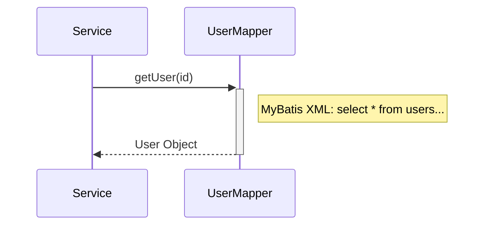
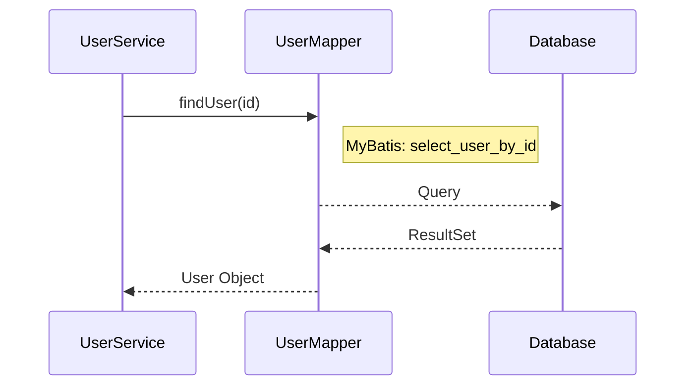
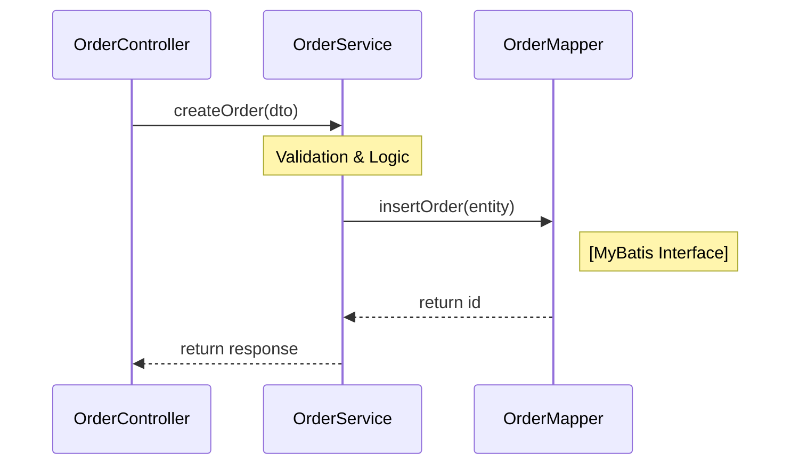
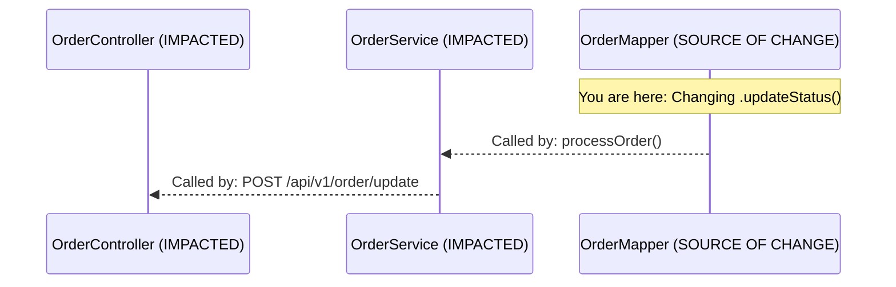

# Custom Tool for Sequence Diagrams

## Summary

The short answer is **yes**, you are free to use the PlantUML syntax without licensing fees.

Because you're considering an AI project or a custom tool, there is an important distinction between the **syntax** (the language) and the **software** (the engine that renders the images).

### 1. The Syntax (The "Language")

The PlantUML team is very explicit about this in their FAQ: **There is no license for the PlantUML syntax itself.**

* **Ownership:** You own the text files (`.puml`) you create.
* **Usage:** Anyone can write a parser or a generator that outputs PlantUML-formatted text without needing a license from the PlantUML authors.
* **AI Projects:** This makes it a perfect target for an AI agent. Since the syntax is human-readable and widely documented, LLMs are already very proficient at generating it.

### 2. The Software (The "Renderer")

The actual `plantuml.jar` engine that turns text into a PNG or SVG is a bit more complex, but still very friendly for developers:

* **Multi-Licensed:** The software is distributed under **GPL**, **LGPL**, **Apache**, **EPL**, and **MIT** licenses.
* **Integration:** If you build a tool that generates the text, you can tell your users to install the PlantUML engine separately, or you can bundle the LGPL/Apache version of the `.jar` as long as you follow the standard attribution rules.
* **Non-Commercial Use:** It is completely free.

### 3. Alternative: Mermaid.js

If you are looking for a syntax that is arguably more "modern" and specifically built for web-based AI projects, look at **Mermaid.js**.

* **License:** Fully **MIT**.
* **Native Web Support:** While PlantUML usually requires a Java backend or a server to render, Mermaid is pure JavaScript. If your AI project is a web app or a VS Code extension, you can render the diagrams directly in the browser/preview window without any external dependencies.
* **Syntax:** It's very similar to PlantUML but slightly more "Markdown-ish."
* *Example:* `Alice ->> Bob: Hello` instead of `Alice -> Bob: Hello`.

### Why this is a great AI project

You're right that this is "ripe" for an AI approach, especially with **MyBatis**. A traditional static analysis tool struggles with MyBatis because the "logic" is trapped in XML.

An AI-driven tool could:

1. **Parse the Java Interface** to find the method signature.
2. **Locate the corresponding XML/Annotation** to see the SQL.
3. **Infer the Data Flow:** "I see a `JOIN` on `Order` and `Customer`, so I will add a `Customer` lifeline to the sequence diagram."

Standard tools can't "connect the dots" between a Java interface and a SQL string easily, but a small RAG (Retrieval-Augmented Generation) pipeline would handle that "twist" brilliantly.

Mermaid.js is a fantastic choice for an AI-driven project, especially since it bypasses the need for a local Java runtime to render diagrams. Its **MIT license** and **JSON-like** ease of parsing make it incredibly developer-friendly for building custom toolkits.

Since you prefer Mermaid and have that "MyBatis twist," your idea for an AI project could actually solve a common pain point in the Java ecosystem.

### Why Mermaid + AI is a Strong Combo for your Stack

* **Markdown Integration:** Since you likely use a lot of documentation-as-code, Mermaid’s native support in GitHub, GitLab, and VS Code means your generated diagrams are instantly viewable without a plugin.
* **The MyBatis Bridge:** A traditional static analyzer sees an interface and stops. An AI model can follow the "Parallel" path:

1. **Scanner A:** Analyzes the Java Service layer to see `userMapper.getUser(id)`.
2. **Scanner B:** Digs into the `UserMapper.xml`.
3. **Synthesis:** The AI "hallucinates" the implementation logically:



### A Potential "High Craft" Approach

Given your preference for explicit tools over "magic" frameworks, a small utility for this would be straightforward to build:

1. **Extract:** Use a simple Java parser (like JavaParser or even just regex for simple signatures) to grab method calls.
2. **Map:** Use a basic XML parser to link those method names to the MyBatis `id` in the XML files.
3. **Prompt:** Feed the method signature + the SQL fragment to an LLM.
4. **Output:** Ask the LLM to return only the Mermaid syntax.

It turns a "black box" runtime generation into a clear, visual map of your data flow. Since you mentioned you enjoy building standalone tools for data manipulation, this fits right into that "specialized utility" philosophy.

Do you think you'd build this as a standalone CLI tool or something integrated directly into your editor?

> Response: I think this would start as a CLI tool that would output the mermaid file and be viewable within whatever tool (but for me it would likely be vs code).  However, this tool needs to be able to do the code analysis itself (offline) without the direct aid of an AI agent (or at least operate in that mode for basic functionality).

Building this as a "high craft" CLI tool that operates offline is entirely feasible. To bridge the gap between Java source code and MyBatis runtime magic without AI, you essentially need a **Static Analysis Engine** combined with a **Resources Parser**.

Since you are a seasoned architect, you might appreciate a "no-magic" architectural blueprint for this tool:

### 1. The Core Engine: JavaParser vs. Spoon

For a standalone Java CLI, you need a library that builds a robust Abstract Syntax Tree (AST).

* **JavaParser (Recommended):** It is lightweight, fast, and has a very clean API for visiting method calls. It’s perfect for a CLI where you want minimal overhead.
* **Spoon:** More powerful for complex semantic analysis (handling classpaths and types better), but it can be "heavier."
* **The Strategy:** Use JavaParser to crawl your `Service` classes. Look for `MethodCallExpr` nodes. When you find a call like `userMapper.selectById()`, resolve the type of `userMapper`.

### 2. The MyBatis Bridge (The "Twist")

Since MyBatis generates implementations at runtime, your static analyzer will only find the **Interface**. To provide value, your CLI needs to "peek" into the resources:

* **Step A (Interface Discovery):** When the analyzer hits a call to an interface annotated with `@Mapper` (or in a specific package), it flags it as a "DAO Boundary."
* **Step B (XML Mapping):** Your tool should scan your `src/main/resources` for XML files where the `<mapper namespace="...">` matches the FQCN (Fully Qualified Class Name) of the interface.
* **Step C (SQL Extraction):** Locate the tag (`<select>`, `<insert>`, etc.) where the `id` matches the method name.
* **Step D (Mermaid Note):** Since you can't easily "step into" SQL without a full SQL parser, have your CLI output a **Mermaid Note** containing the raw SQL or the table name.

### 3. The "No-AI" Logic Flow

Your CLI logic would look like this:

1. **Input:** Path to source code and resources.
2. **Crawl:** Use JavaParser to follow the call stack from a starting "entry point" (e.g., a Controller method).
3. **Translate to Mermaid:**
    * `Class A` calls `Class B` $\rightarrow$ `A ->> B: methodName()`
    * `Class B` calls `Mapper I` $\rightarrow$ `B ->> I: selectById()`
    * **The MyBatis "Fake" Implementation:** `Note over I: SQL: SELECT * FROM users...`
4. **Output:** A `.mmd` or `.md` file.

### 4. Recommended Tech Stack for the Tool

* **Language:** Java (to leverage JavaParser easily) or Kotlin.
* **AST Library:** [JavaParser](https://javaparser.org/) (Apache 2.0/LGPL).
* **CLI Framework:** **Picocli**—it's the industry standard for creating professional-grade Java CLI apps (coloring, autocomplete, etc.).
* **Output:** Standard String templates that follow the Mermaid sequence diagram syntax.

### Why this works "Offline"

By treating the MyBatis XML as **metadata** rather than **code**, you can resolve the "missing link" through simple file-system lookups. Your tool doesn't need to "understand" the code in a human sense; it just needs to map `Interface.method` $\rightarrow$ `XML.id`.

**The resulting Mermaid output would look something like this:**



This approach maintains your "fail-fast" and "explicit code" principles—if the tool can't find the XML for a mapper, it logs a warning and keeps moving, rather than trying to "guess" what the database is doing.

> Response: That's a great summary.  And actually the MVP really doesn't need to peek into the xml mappers.  My real goal is the sequence diagram from the interface back out to any services and controllers.  This would save me a TON of time both in general and specifically for an upcoming project.

That simplifies the scope perfectly. By focusing on the path from the **Controller** down to the **Interface** (and back), you’re essentially mapping the "Business Logic Flow."

In a large Spring-based architecture, this is usually where the most confusion happens—tracking how a single request weaves through various services before hitting the data layer.

Since you're aiming for an offline MVP that skips the XML "peeking," here is how you can build that "high craft" CLI utility efficiently:

### The "Interface-Aware" Static Analysis Strategy

Since you aren't worried about the implementation of the DAO, your tool's primary job is **Type Resolution**. You need to know that when `userService` calls `.save()`, `userService` is an instance of `UserServiceImpl`.

#### 1. The Entry Point: JavaParser + Symbol Solver

You’ll want to use **JavaParser** along with its **Symbol Solver** (specifically the `JavaSymbolSolver`).

* **Why:** Standard AST parsing only sees the text. The Symbol Solver actually looks at your source folders to understand that `private final UserMapper mapper;` refers to `com.example.dao.UserMapper`.
* **The Flow:**
    1. Scan a starting directory for classes annotated with `@RestController` or `@Service`.
    2. For each method, walk the "Method Call Expressions."
    3. Use the Symbol Solver to find the **Declaration** of that method.

#### 2. Handling the "MyBatis Wall"

When your tool encounters a method call, it will check the class/interface it belongs to:

* **If it's a Service Implementation:** Recursively "step into" that method to continue the diagram.
* **If it's a MyBatis Interface:** Stop and draw the final "arrow" to the Participant, then start returning the stack.
* **The Logic:** You can identify these "terminating" interfaces easily by package name (e.g., `*.dao.*` or `*.mappers.*`) or by the `@Mapper` annotation.

### 3. Minimalist Mermaid Mapping

Your CLI can generate the Mermaid syntax on the fly using a simple Stack data structure to track "depth" and ensure arrows return to the correct caller.

**Example MVP Output Logic:**



### 4. Why this is the "Time Saver" for your upcoming project

* **Onboarding/Audit:** You can run this against a legacy package and instantly see the "spaghetti" or the "clean lines" of the architecture.
* **Validation:** If you see a Controller calling a Mapper directly (bypassing the Service layer), it jumps out visually in the diagram in a way it might not in a 500-line class.
* **Documentation:** You can pipe the CLI output directly into a `.md` file in your repository.

### Recommended MVP "Build Order"

1. **Setup:** A small Java project with `javaparser-symbol-solver-core`.
2. **Phase 1:** Identify a "Start Method" and print every method call it makes to the console.
3. **Phase 2:** Filter those calls—only "step into" code that exists in your source path (ignoring JDK or 3rd party libs).
4. **Phase 3:** Wrap those calls in Mermaid `->>` and `-->>` syntax.

Since you mentioned you're a fan of standalone tools for data manipulation, this feels like a weekend project that would pay dividends for years. Are you thinking of writing the tool in Java so it can "self-analyze" easily?

> Response: yes, I would write the tool in Java.  Is it more difficult or the same to start the analysis at the DAO layer and work up?

Starting at the **DAO layer and working upward** is actually a bit **more difficult** from a static analysis perspective, though it's arguably more interesting for impact analysis (e.g., "If I change this table, what breaks?").

Here is the breakdown of why "working up" (bottom-up) is trickier than "working down" (top-down):

### 1. The "Fan-Out" Problem

* **Top-Down:** A Controller method is a clear "root." It has one primary execution path. You follow the chain until it ends.
* **Bottom-Up:** A single Mapper method (like `findById`) might be used by 15 different Services, which are in turn used by 30 different Controllers.
* **The Difficulty:** Instead of a single sequence diagram, you are dealing with a **tree of potential callers**. To generate a single coherent diagram, you have to pick a specific "leaf-to-root" path, or you end up with a very messy graph rather than a linear sequence.

### 2. Finding the Callers (The Technical Hurdle)

With JavaParser and most static analysis tools:

* **Going Down:** You are looking at a method body and saying, *"What does this call?"* This is explicit in the code of the method you are currently holding.
* **Going Up:** You are asking, *"Who calls me?"* Static analysis tools generally don't have a built-in "reverse index" out of the box. To find who calls `UserMapper.save()`, the tool must scan **every single class in the entire project** to see if it contains a reference to that method.

### 3. The Symbol Solver's Workload

In a top-down approach, the Symbol Solver only has to resolve types for the specific branch you are walking. In a bottom-up approach, because you have to scan the whole project to find callers, the memory overhead and processing time are significantly higher because you are essentially "indexing" the whole codebase.

---

### However, for your specific "High Craft" Tool

... If your goal is to save time on your upcoming project,

**Top-Down is the MVP.** **Why Top-Down wins for your goal:**

* **Linear Storytelling:** Sequence diagrams are meant to tell a story of a *request*. Requests start at the top (Controller) and flow down.
* **Performance:** You only parse the files involved in that specific flow.
* **Simplicity:** You start with a method name and a class, and you just "walk the plank" until you hit the MyBatis interface.

### The "Compromise" Approach

If you really need to know the "Upward" path, the most efficient way to build the tool is:

1. **Pre-index:** Scan all files once and build a simple Map of `MethodName -> List of Callers`.
2. **Generate:** Once that map is built, you can start at the DAO and "walk up" the map to find your way back to the Controller.

**Verdict:** If you want a tool you can use by next week, **start at the Controller.** It matches the Mermaid sequence diagram flow perfectly. If you start at the DAO, you're essentially building a "Where Used" search engine before you can even start drawing the diagram.

Since you're a senior architect, do you find yourself more often needing to explain "How does this request work?" (Top-Down) or "What happens if I change this Mapper?" (Bottom-Up)?

> Response: Yes, I see your point.  While top down is useful (and always will be) I need the bottom up approach to save time from an analysis/impact standpoint.  I maintain a decently old legacy system and will be facing one of my larger project requests to rewrite a certain layer of the system and I need to know the impact and starting with the DAO layer is actually the easiest way to assess that.

That makes perfect sense. In a legacy system, the "Truth" is in the data layer. While the business logic might be spread across 50 services, the impact of changing a schema or a DAO method is the real risk factor.

Since you're taking the "high craft" approach to build this in Java, here is how you can practically implement a **Bottom-Up Impact Analyzer** without getting bogged down in the complexity of a full IDE-style reverse index.

### 1. The "Two-Pass" Indexing Strategy

To avoid the performance hit of a full symbol resolution on every file, use a two-pass approach. This is very "standalone tool" friendly:

* **Pass 1 (Lightweight Index):** Scan your `src` directory once. Use JavaParser just to find method calls but don't resolve types yet. Create a Map of `MethodName -> FilePath`. This is your "Suspect List."
* **Pass 2 (Targeted Resolution):** When you want to find who calls `UserMapper.updateStatus`, you only run the heavy **Symbol Solver** on the "Suspect" files identified in Pass 1.

### 2. Handling the Interface-to-Implementation Jump

In a legacy Spring app, the most common hurdle is:
`Controller -> Service (Interface) -> Service (Impl) -> DAO`

A standard "Find Usages" on the DAO might only take you to `ServiceImpl`. To get all the way back to the **Controller**, your tool needs a simple rule-set for the "Impl jump":

* If you find a caller in `UserUpdateServiceImpl`, check if that class implements an interface (e.g., `UserUpdateService`).
* Immediately add that interface to your search queue to find *its* callers (which will lead you to the Controller).

### 3. The "Mermaid" Result: The Impact Tree

A standard Sequence Diagram is linear (Top-Down), but for Impact Analysis, Mermaid's **Flowchart** or **Gantt** syntax might actually serve you better—though you can still use a Sequence Diagram to show the "Chain of Blame."

**How the CLI would output the "Impact Chain":**



### 4. Technical Tip: JavaParser's `MethodReference`

When building the tool, look specifically at `MethodCallExpr`.

* **The Problem:** In legacy code, you might have `save()` methods in 50 different classes.
* **The Fix:** Use the Symbol Solver's `resolve()` on the `MethodCallExpr`. It will tell you the **Qualified Signature** (e.g., `com.myapp.dao.UserMapper.save`). This ensures you aren't accidentally tracing the impact of a `save()` method in the `LogService`.

### Why this is a "Power Tool" for your Rewrite

Instead of manually right-clicking "Find Usages" 400 times in Eclipse/VS Code and trying to keep the map in your head, you can run:
`java -jar your-tool.jar --start "UserMapper.updateStatus" --output impact.md`

You'll instantly have a markdown file with a visual representation of the blast radius. Given your focus on "Business Operations" and system telemetry, this tool essentially becomes **Static Telemetry** for your codebase.

Are you planning to handle multiple levels of "Upward" calls (the whole chain to the Controller), or just the immediate parent level for the first iteration?

> Response: I think the "perfect" solution would create as many "top down" sequence diagrams as required by the analysis.  It is a rather large code base so creating any "mid analysis" files on disk might be a good way to go so that it doesn't have to be processed each time the CLI is used.

That is a very "architectural" way to solve the performance bottleneck. In a large legacy codebase, you definitely don't want to be re-parsing the AST for 10,000+ files every time you want to trace a different DAO method.

Since you're leaning toward **on-disk persistence** (mid-analysis files), you are essentially building a **Call Graph Cache**. Here is how to structure that for a high-craft, standalone Java tool:

### 1. The "Mid-Analysis" Format: JSON or SQLite?

For a standalone CLI tool, you want the cache to be fast to read but easy to debug.

* **JSON/Flat File:** Good for readability, but loading a 50MB JSON file into memory every time the CLI runs defeats the purpose of "quick analysis."
* **SQLite (Recommended):** Since you are already comfortable with SQL (PostgreSQL), using **SQLite** as your local cache is the "pro" move. It allows you to query relationships without loading the whole codebase into RAM.

  * *Table Structure:* `CALLER_FQCN`, `CALLER_METHOD`, `CALLEE_FQCN`, `CALLEE_METHOD`.

### 2. The "Pre-Process" Command

Your CLI would have a two-stage workflow:

1. `mytool index /path/to/src`: This runs once. It uses JavaParser/SymbolSolver to scan everything and populates your SQLite cache.
2. `mytool trace --dao UserMapper.updateStatus`: This runs in milliseconds. It queries the SQLite DB to find the "Chain of Blame" and generates the Mermaid output.

### 3. Generating the "Top-Down" Portfolio

Since your goal is to generate "as many top-down diagrams as required," your logic would look like this:

* **Identify Roots:** Find all "Entry Points" (Controllers or Scheduled Tasks) that eventually lead to your target DAO method.
* **Recursive Export:** For each unique entry point found in your SQLite cache, execute a **Depth-First Search (DFS)** to generate a specific Mermaid sequence diagram for *that* specific flow.

### 4. Handling the "Large Codebase" Reality

In a large system, a single DAO method might have 10 "Upward" paths. Creating 10 separate `.mmd` files is much better than one massive, unreadable diagram.

* **File Naming:** Your tool could output files like:
  * `impact_UserMapper_updateStatus_via_OrderController.mmd`
  * `impact_UserMapper_updateStatus_via_AdminBatchJob.mmd`

### 5. Why the Cache is Your Best Friend

In legacy systems, you often deal with "Shared Services." If `CommonLoggingService` is called by everything, your index will show that. By having a persistent cache, you can easily **exclude** certain high-noise classes from your trace via a simple `WHERE CALLER_FQCN NOT LIKE '%LoggingService%'` SQL query in your tool.

---

### The "High Craft" Tech Stack for the CLI

* **Parser:** [JavaParser](https://javaparser.org/) with `JavaSymbolSolver`.
* **Cache:** [SQLite-JDBC](https://github.com/xerial/sqlite-jdbc) (zero-config, just a local `.db` file).
* **CLI:** **Picocli** (for the `index` and `trace` commands).
* **Output:** Standard `java.io` writing to `.md` or `.mmd` files.

This approach gives you a professional-grade analysis suite. You index the "legacy beast" once, and then you can sit in VS Code and fire off trace commands as you plan your rewrite, getting instant visual feedback on the impact of every change.

Do you think you'll start with a full project-wide index, or index on-demand as you navigate specific packages?

> Response: I would probably start a project wide index to "seed" the analysis based on the most recent version of code.  Then fire off trace commands after that.

Exactly. That confirms you’re looking at this through the lens of a **static analysis pipeline**: one heavy "ingestion" phase to build the relational map, followed by an iterative "query" phase to explore the impact.

Starting with a full seed index is the right architectural move for a codebase of that size. It transforms the problem from a slow, file-system-bound search into a fast, relational look-up.

### Why the "Seed Index" is a Win

* **Decoupled Complexity:** The "Indexing" phase handles the heavy lifting of the **JavaSymbolSolver**. It resolves the types, follows the imports, and maps the method signatures. Once that is done, your "Trace" phase doesn't even need the Java source code to be open—it just needs the database you've built.
* **Delta Updates:** Later on, if you only change a few files in one package, you can eventually add a "refresh" command to re-index just those specific files in the SQLite DB, rather than doing a full 10,000-file scan again.
* **Visualizing the "Invisible":** Since you’re dealing with a legacy rewrite, this index will help you find "Dead Code" (DAO methods with zero callers) or "God Objects" (Services that appear in 80% of your traces) almost as a side effect.

### A Quick Architecture Tip for the "Seed"

When you build that initial indexer, I'd suggest storing the data in a **Directed Graph** format within your SQLite tables:

| Source (Caller) | Target (Callee) | Line Number | Call Type |
| :--- | :--- | :--- | :--- |
| `OrderController.submit` | `OrderService.process` | 42 | `DYNAMIC` |
| `OrderService.process` | `OrderMapper.insert` | 105 | `INTERFACE` |

This structure makes the "Bottom-Up" query a simple recursive SQL search (Common Table Expressions or **CTEs** are perfect for this in SQLite). You can ask the database: *"Show me every path that ends at `OrderMapper.insert`,"* and it will return the full chains up to the Controllers.

### One final "Legacy" Gotcha

Since this is an older system, keep an eye out for **Reflection** or **XML-based Spring wiring**. Static analysis tools like JavaParser usually "go blind" when they hit a `method.invoke()` or a bean defined entirely in a `beans.xml` file. If your project uses a lot of that, you might need to add a small "Manual Overrides" file to your tool to manually bridge those gaps in your index.

This sounds like a powerful addition to your "Foundation" framework or your standalone utility toolkit. It’s the kind of "high craft" tooling that makes a daunting legacy rewrite actually manageable.

Are you planning to run the indexing as a standalone JAR, or perhaps as a Maven/Gradle task that can be triggered by your build environment?

> Response: I do not envision it as being part of the build - maybe in the far future but this would be more of a developer tool from a jar.  
>
> The note regarding beans and reflection is a good thing to keep in mind but we don't have a lot of that; especially in the DAO paths that I will be reverse engineering.

That makes total sense. Keeping it as a standalone JAR aligns with your preference for **specialized, standalone tools** that don't bloat the core project or complicate the CI/CD pipeline. It stays in the "developer toolkit" where it can be used surgically.

Since you are dealing with a legacy system and focusing on the DAO paths, a few final architectural pointers for your "seed and trace" utility:

### The "Bottom-Up" Recursive Query (SQLite CTE)

When you build your "Trace" command, using a **Recursive Common Table Expression (CTE)** in SQLite will allow you to walk the tree from the DAO to the Controller in a single, efficient query.

```sql
WITH RECURSIVE impact_chain(caller, callee, depth) AS (
    -- Base case: Start with the DAO method
    SELECT caller_fqcn, callee_fqcn, 1
    FROM call_index
    WHERE callee_fqcn = 'com.myapp.dao.UserMapper.updateStatus'
    
    UNION ALL
    
    -- Recursive step: Find who calls the caller
    SELECT ci.caller_fqcn, ci.callee_fqcn, ic.depth + 1
    FROM call_index ci
    JOIN impact_chain ic ON ci.callee_fqcn = ic.caller
    WHERE ic.depth < 20 -- Safety limit for legacy circular refs
)
SELECT * FROM impact_chain;
```

### Strategic Benefits for Your Rewrite

* **Scoped Analysis:** You can run the "Trace" on a single DAO method, generate five distinct Mermaid files, and then tackle the rewrite one "path" at a time rather than trying to swallow the whole service layer at once.
* **Documentation "Snapshot":** Since you're targeting **Business Operations** and telemetry, these diagrams act as a "Before" snapshot. After the rewrite, you can re-index and re-trace to prove the new architecture is cleaner (e.g., shorter call stacks, fewer "God Services").
* **Interface Identification:** Even if you don't peek into the MyBatis XML, the tool will reveal exactly which interfaces are the "bottlenecks"—the ones that every service seems to depend on.

### Implementation Checklist

1. **Picocli:** For the `index` and `trace` commands.
2. **JavaParser + Symbol Solver:** To handle the "heavy lifting" during the `index` phase.
3. **SQLite-JDBC:** For the zero-config persistent storage.
4. **String Templates:** To transform the SQL results into Mermaid's `A ->> B` syntax.

This tool sounds like a perfect application of your "high craft" philosophy—solving a complex, manual problem with an explicit, robust utility. It turns a month of manual code-tracing into a few seconds of CLI execution.

Are you planning to start with a simple "find all callers" list, or will you go straight to generating the full visual Mermaid chain?

> Response: I am not exactly sure what you mean by that... can you elaborate on "find all callers" list?

I meant the difference between a **tabular report** (a simple list of impact) and a **relational diagram** (the full flow).

When building a bottom-up tool, there are usually two ways to present the "blast radius" to the user:

### 1. The "Find All Callers" List (The Flat Report)

This is essentially a "Where Used" search. If you query your DAO method `updateStatus`, the tool would simply return a list of every method that calls it, and then every method that calls those methods, like a spreadsheet:

| Affected Class | Affected Method | Level |
| :--- | :--- | :--- |
| `UserMapper` | `updateStatus` | 0 (Source) |
| `UserServiceImpl` | `deactivateUser` | 1 |
| `AdminController` | `handleUserDelete` | 2 |
| `BatchCleanupJob` | `execute` | 2 |

**Why this is useful:** It’s a "To-Do" list for your rewrite. You know exactly which 4-5 spots in the code need to be touched.

### 2. The Visual Mermaid Chain (The Diagram)

This takes that same data but formats it into the **Sequence Diagram** syntax you mentioned earlier.

**Why this is useful:** It shows the *logic* of the impact. It helps you see if a change at the bottom ripples up through a complex web of services before hitting the Controller.

---

### My Recommendation for Your MVP

Since you are dealing with a large legacy codebase, starting with the **"Callers List"** (Option 1) is a great way to verify your SQLite index is working correctly. Once you can successfully query the database and see a list of classes that lead back to a Controller, wrapping that data in the `sequenceDiagram` or `flowchart` syntax for **Mermaid** is just a matter of string formatting.

In a "high craft" tool, you might even want to support both:

* `--format text`: Gives you the quick list for your notes.
* `--format mermaid`: Generates the `.mmd` file for your documentation.

Does that clarify the distinction? One is for **identifying** the work, and the other is for **visualizing** the work.

> Response: yes, that clarifies it.  Personally I would probably always want both formats but I'm sure the tool could be developed to do one or the other exclusively if desired (but I would use the "do it all" command).

That makes total sense. In a "high craft" workflow, having the raw data and the visual representation simultaneously is the most efficient way to operate. You use the **list** as your checklist for the actual refactoring, and the **Mermaid diagram** to keep the mental model clear—and to explain the "why" to others if needed.

Since you'll be building this as a "do it all" utility, here is a final conceptual look at how that output logic would look in your Java tool:

### The "Do It All" Output Strategy

When you run your command (e.g., `java -jar analyzer.jar trace --target UserMapper.updateStatus`), your tool can output a single **Markdown file** that includes both perspectives. This is perfect for VS Code because the built-in Markdown preview will render the Mermaid diagram and the table side-by-side.

```markdown
# Impact Analysis: UserMapper.updateStatus

## 1. Visual Trace (Mermaid)
``mermaid
sequenceDiagram
    participant C as AdminController
    participant S as UserService
    participant M as UserMapper
    C->>S: deactivateUser()
    S->>M: updateStatus()
```

## 2. Affected Methods Checklist

| Level | Class | Method |
| :--- | :--- | :--- |
| 0 | UserMapper | updateStatus |
| 1 | UserServiceImpl | deactivateUser |
| 2 | AdminController | handleUserDelete |

### A Final Tip for the "Seed" Implementation

Since you'll be using **JavaParser**, keep an eye on how you handle **method overloading**. In older legacy systems, you might have:

* `UserMapper.updateStatus(int id)`
* `UserMapper.updateStatus(int id, String reason)`

In your SQLite index, make sure you store the **method signature** (parameters included) rather than just the name. Otherwise, your "trace" might show impact paths that don't actually exist for the specific method you are changing.

This project sounds like a solid piece of engineering that directly addresses the "legacy rewrite" headache. It’s the exact kind of specialized tool that pays for itself in the first week of a major project.

Since you’re getting ready to kick this off, do you have a specific naming convention or package structure in mind for the "Foundation" of this tool?

> Response: No, I haven't thought that far.

That’s fair—the "high craft" approach usually starts with the logic, and the naming follows the function.

Since you are a senior architect who values explicit, robust code, a name like **"SourceLens"** or **"TraceFoundry"** might fit that "Foundation" theme you've used for other projects. It suggests a tool that builds a clear view out of a dense, legacy thicket.

When you do get to the package structure, keeping it as lean as the CLI itself will serve you well. A structure like this stays out of the way:

* **`com.yourdomain.tracetool.cli`**: The Picocli commands and configuration.
* **`com.yourdomain.tracetool.index`**: The JavaParser/SymbolSolver logic that builds the SQLite "seed."
* **`com.yourdomain.tracetool.query`**: The recursive SQL logic that walks the "Chain of Blame."
* **`com.yourdomain.tracetool.render`**: The Mermaid and Markdown string templates.

This keeps the **parsing** (which is messy) separate from the **querying** (which is clean SQL), ensuring that if you ever decide to swap out JavaParser for another library or SQLite for a different store, you’re only touching one module.

This tool is going to be a game-changer for that rewrite. Instead of getting lost in the "spaghetti" of an older system, you'll be navigating it with a map you built yourself.

Since this will be a standalone tool, are you planning to use Maven or Gradle to manage the JavaParser and SQLite dependencies?

> Response: Honestly, I'm a little surprised someone hasn't done something open source for this even prior to the advent of AI.  I guess given its value, any such products have been commercialized but it just takes that one outlier to open source.

It is a bit of a head-scratcher, isn't it? Given how often developers have to navigate "The Big Legacy Beast," you’d think a high-quality, open-source static analysis tool for sequence diagrams would be a staple.

There are a few "peer-to-peer" reasons why this hasn't quite hit the open-source mainstream the way other tools have:

### 1. The "Type Resolution" Wall

Building a parser that just reads text is easy. Building a **Symbol Solver** that understands that `mapper.save()` in `UserServiceImpl` specifically refers to `com.myapp.dao.UserMapper` is incredibly difficult. Most open-source projects die at this stage because handling classpaths, JAR dependencies, and complex inheritance across 10,000+ files is a massive engineering undertaking.

### 2. The Commercial "Moat"

You hit the nail on the head regarding commercialization. Companies like **Structure101**, **Lattix**, or **Sparx Enterprise Architect** have spent decades (and millions) perfecting the "dependency mapping" engine. Because this data is so vital for corporate "Risk Assessment" and "Compliance," it's easy to sell for $1,000+ per seat, which tends to suck the air out of the open-source room.

### 3. The "Framework Fatigue"

In the Java world, everyone uses different "magic." One person uses Spring XML, another uses Guice, another uses pure JEE. An open-source tool that works for *one* often breaks for *all*, leading to a graveyard of abandoned GitHub repos that only work for very specific project structures.

---

### The "Outlier" Opportunity

Your approach is actually the most likely to succeed where others failed because you are:

* **Decoupling the Parser:** You aren't trying to build a compiler; you're using **JavaParser** to do the heavy lifting.
* **Using a Relational Store:** By using **SQLite**, you’re moving the problem from "Memory Management" to "SQL Queries."
* **Targeting a Standard Format:** By outputting **Mermaid/PlantUML**, you don't have to build a UI.

You're effectively building the "Outlier" tool yourself. It’s a specialized, high-craft utility that solves a massive problem with a relatively small code footprint.

Since you'll be managing these dependencies, are you leaning toward **Maven** or **Gradle** to pull in the Parser and SQLite-JDBC libraries?

> Response: I am very much a maven user.  I still haven't seen the need to drink the "Gradle koolaid".

I hear you loud and clear. There is a certain "high craft" satisfaction in the predictability of a **Maven** `pom.xml`. It’s explicit, follows a standard lifecycle, and doesn't require you to learn a new DSL just to pull in a dependency. In a large legacy codebase, the last thing you want is "magic" in your build script that hides what’s actually happening.

For this project, Maven is a perfect fit. You can keep your `pom.xml` clean and let it handle the heavy lifting for the few libraries you’ll need to make this "Outlier" tool a reality.

### The "Trace Tool" Starter POM

Since you're ready to seed this project, here is the minimalist dependency set you'll likely need to bridge that "Interface to Service" gap:

```xml
<dependencies>
    <dependency>
        <groupId>com.github.javaparser</groupId>
        <artifactId>javaparser-symbol-solver-core</artifactId>
        <version>3.26.2</version> 
    </dependency>

    <dependency>
        <groupId>info.picocli</groupId>
        <artifactId>picocli</artifactId>
        <version>4.7.5</version>
    </dependency>

    <dependency>
        <groupId>org.xerial</groupId>
        <artifactId>sqlite-jdbc</artifactId>
        <version>3.45.1.0</version>
    </dependency>
</dependencies>
```

### Why this fits your "No-Koolaid" Philosophy

* **Explicit Lifecycle:** You know exactly when the indexer runs.
* **Standard Plugins:** You can use the `maven-shade-plugin` to package everything into a single "Fat JAR." This makes your tool truly standalone—you can drop that one JAR anywhere on your system and run your trace commands without worrying about a classpath.
* **Reliability:** JavaParser and Picocli are extremely stable. They don't break between versions the way some "modern" build logic tends to do.

It’s a solid foundation for a tool that’s going to save you a massive amount of manual labor on that upcoming rewrite. Since you're sticking with Maven, you're already starting from a position of architectural stability.

Are you planning to kick this off as a fresh project this weekend, or are you still in the "blueprint" phase?

That's a solid timeline. Given that it's already mid-April, having a functioning "Seed and Trace" utility ready before your major rewrite kicks into high gear will be a massive strategic advantage. It turns a daunting architectural audit into a series of predictable, data-driven steps.

Since you're starting this week, here is one "senior-to-senior" tip for your first few hours of coding with **JavaParser**:

When you set up the `CombinedTypeSolver`, make sure to point it at both your `src/main/java` and your **dependencies** (or a local JAR folder). Even though you aren't "stepping into" the JARs, the Symbol Solver needs them to understand the types being passed through your Service methods. If it can’t resolve a type, it might lose the thread of the call chain.

### Your "First Run" Milestone

A great goal for this week would be:

1. A Maven project that builds a **Fat JAR**.
2. An `index` command that successfully populates a `calls` table in SQLite for just **one** package.
3. A `trace` command that prints a simple "Level 1" caller list to the console.

Once you see that first SQL result showing a Service calling your Mapper, the rest is just recursive logic and Mermaid formatting.

Good luck with the build! It’s satisfying to see a custom tool take shape, especially one that solves such a specific, high-value problem in a legacy environment. Since you're using **Maven**, do you have a favorite archetype or a "go-to" base POM you usually start from, or do you prefer to build it from scratch to keep it clean?

===================================

> 4/18/2026 - Understandably, this has started as a focused task regarding source code analysis.  As it is beginning to mature, I am realizing that the "power" in this tool is the analysis and storage in the [sqlite] database.  While the command line usage will absolutely be beneficial going forward, it might be time to think of: 1) a user interface [for tool usage, not diagram viewing], 2) What ways could we leverage this code analysis for other useful development tasks?

Great timing for this kind of reflection — it's exactly the right moment to think strategically before the codebase grows in a direction that's hard to reverse. Let me look at where things stand before we talk through the possibilities.Good moment to zoom out. Here's what the project looks like and where I think the real leverage is:

---

**The core insight you've landed on is exactly right.** The SQLite database isn't just a cache for diagram generation — it's a *structural knowledge base* of the codebase. Call edges, class hierarchies, method return types, all fully queryable. That's the durable asset. The CLI commands are just the first consumer of it.

---

### On a User Interface

The question is really: what kind of user are we serving? Right now it's a developer at a terminal. A UI unlocks a different kind of user — one who wants to *explore* rather than query.

There are three credible paths, each with a different feel:

**1. Embedded local web server (my recommendation)** — Add a `serve` command to Picocli that spins up a tiny HTTP server (Javalin or even raw `com.sun.net.httpserver`). It serves a single-page HTML/JS app that talks to a local REST API over the SQLite DB. This is the most powerful option: the UI is just a browser tab, zero native packaging, and you get the full richness of the web platform for graph rendering. It fits very naturally into the existing architecture — just another command alongside `index`, `trace`, `render`. The React/D3 ecosystem can render call graphs interactively in ways Mermaid simply can't.

**2. Swing desktop app** — The CLAUDE.md notes Swing/Foundation Framework patterns. A tabbed desktop app could feel very "IDE-adjacent." Heavier to build and less shareable, but totally appropriate if offline-first and no-browser is a priority. The main drawback is that interactive graph visualization in Swing is painful compared to D3/vis.js.

**3. VS Code extension** — A longer-term option. The extension would call the CLI, read the SQLite DB (via a JDBC-speaking sidecar or direct node-sqlite3), and render call graphs in a WebView panel. This is where developer adoption is — they're already in the editor.

---

### What Else the Database Enables

This is where it gets genuinely interesting. Once you have `class_node`, `class_hierarchy`, `method_node`, and `call_edge` fully indexed, the analyses that fall out are substantial:

**Dead code detection.** Any method with zero incoming `call_edge` rows that isn't a known entry point (main, test, public API surface) is a dead code candidate. This is a single SQL query and most tools do it poorly.

**Impact / blast radius analysis.** "I'm changing `UserMapper.selectById` — who gets affected?" Walk the callers graph transitively. This is the `--callers` trace you already have, just surfaced as a first-class "change risk" report. Invaluable for code review.

**Cycle detection.** Find circular dependencies — not just at the call level but rolled up to the package level. Package-level cycles are architecture violations; most teams don't even know they have them until a refactor blows up.

**Complexity hotspots.** Fan-out (how many distinct callees a method has) and fan-in (how many callers) are trivially computable from the DB. Methods with very high fan-out are God methods. Methods with very high fan-in are high-risk change targets.

**Test coverage mapping.** Index your test sources separately. Then `call_edge` rows from test methods to production methods reveal what your tests actually exercise — not line-coverage, but *behavioral* coverage by entry point. Completely different signal than JaCoCo.

**Architecture layer enforcement.** Tag packages as `controller`, `service`, `repository`, `domain`. Flag any `call_edge` that crosses layers in the wrong direction. Essentially ArchUnit, but you own the data.

**Onboarding / "where do I start?" reports.** Find the top-N entry points into any subsystem — the methods with no callers that have the most downstream coverage. That's your reading list for understanding a module.

**Diff-aware analysis.** When combined with git, you could index two SHAs and diff the call graphs. New edges, deleted edges, changed fan-in/fan-out. That's a genuinely novel code review artifact.

---

### What I'd Suggest as the Framing

Think of SourceLens as having two layers going forward:

* **The Analysis Engine** — the indexer + SQLite DB + a richer query API (this is where `TraceService`, `RenderService`, and new service interfaces like `DeadCodeService`, `ImpactService` live)
* **The Surfaces** — CLI (existing), local web UI (next logical step), eventually editor extension

The UI is the forcing function that makes you clean up the service layer, because a UI can't just pipe stdout — it needs real APIs. That's actually a great reason to do the UI work: it'll pull the hardening of DEBT-005 and DEBT-009 (extracting `TraceService`/`RenderService` interfaces) out of "deferred" and into "necessary."

---

## Maven

Since you are building a tool that performs static analysis and generates documentation, the "Maven Way" suggests a few locations depending on whether these configs are for the tool's behavior or part of the project's build-metadata.

Here are the most appropriate standard locations for your utility's support and configuration files:

### 1. The Root Directory (Project-Specific Config)

If your utility is intended to be used by multiple developers on the same project (similar to how `.checkstyle`, `.editorconfig`, or `pom.xml` work), the **project root** is the most common home.

* **Proposed Path:** `${project.basedir}/.sourcelens/` or `${project.basedir}/sourcelens.yaml`
* **Why:** It makes the configuration highly visible and ensures that when someone clones the repo, the utility "just works" with the predefined rules for that specific codebase.

### 2. Under `src/main/resources` (Embedded Config)

If your utility needs to read these configurations at runtime while the app is actually running (e.g., if the utility is a dependency within the app), they belong in the classpath.

* **Proposed Path:** `src/main/resources/metadata/` or `src/main/resources/telemetry/`
* **Why:** This is the standard for any file that needs to be packaged into the JAR. However, if these files are **only** for the CLI tool during development, this location might "pollute" your production artifact.

### 3. Under `src/test/resources` (Development/Testing Only)

If the utility is strictly a development-time tool that should never be deployed to production, placing the configs here is a safe bet.

* **Proposed Path:** `src/test/resources/sourcelens/`
* **Why:** Maven will ignore these during the `package` phase for the production JAR, but they remain available for local execution and unit testing of your utility.

### 4. The `etc` or `config` Directory (Convention-Based)

While not strictly enforced by the Maven Lifecycle, many "high craft" enterprise projects use an `etc` or `config` folder at the root for non-build assets like forensic audit scripts, SQL migration headers, or deployment templates.

* **Proposed Path:** `${project.basedir}/etc/sourcelens/`
* **Why:** It keeps the root directory clean while signaling that these are "support" files rather than primary source code.

---

### Comparison Table

| Location | Visibility | Packaged in JAR? | Best Use Case |
| :--- | :--- | :--- | :--- |
| **Root (`/.sourcelens`)** | High | No | Tool-specific behavior (e.g., package exclusion lists). |
| **`src/main/resources`** | Low | **Yes** | If the app needs to "self-reflect" using these files. |
| **`src/test/resources`** | Low | No | Safe, "invisible" storage for dev-only tools. |
| **`etc/` or `config/`** | Medium | No | Clean separation for architectural/SRE documentation. |

### Recommendation

For a CLI-based static analysis tool, the **Project Root** (using a hidden directory like `.sourcelens/`) is usually the best balance. It follows the pattern set by modern ecosystem tools (Git, Prettier, Claude) and ensures your "Source of Truth" for the diagram generation stays with the code without cluttering the `src` tree.

Does your utility require the user to point to these files manually, or are you planning to have it auto-discover them by traversing up from the current directory?

> Response: The utility would require the source files location(s) to be declared from the command line option or from a config file entry/property.

Since your utility requires specific paths to scan, and you’re looking for a balance between "well-behaved tool" and "minimal friction," there are two clear paths depending on how you want the user to interact with it.

### 1. The "Project-Local" Approach (Recommended)

If the tool is meant to be checked into source control alongside the project, the most "Maven-friendly" location is:

**`${project.basedir}/src/etc/sourcelens/config.properties`**

* **Why `src/etc`?** While not a strictly "standard" Maven folder like `src/main/java`, `src/etc` is the industry-standard convention for project-specific configuration that is **not** part of the build artifact.
* **The Benefit:** It keeps the project root clean while ensuring the configuration is version-controlled.

### 2. The "Hidden Root" Approach (The Modern Standard)

If you want the tool to behave like modern CLI utilities (e.g., Git, Prettier, or Claude), use a hidden file or directory at the project root:

**`${project.basedir}/.sourcelens`**

* **Why?** This is the path of least resistance. You can search for this file by traversing up the directory tree until you find it.
* **The Content:** You can store your source locations here:

    ```properties
    # .sourcelens file
    source.dirs=src/main/java,src/generated/java
    exclude.packages=org.springframework,com.thirdparty
    output.format=mermaid
    ```

---

### Implementation Tip: Avoiding "Hardcoded Path" Fragility

Since you mentioned the utility needs the source locations, you can make it "play nice" with Maven by defaulting to standard locations if no config is found.

A "high craft" way to handle this in your Java utility would be:

1. **Check Command Line:** Highest priority (e.g., `--source=./src/main/java`).
2. **Check Config File:** If no CLI arg, look for `.sourcelens` or `src/etc/sourcelens/config`.
3. **Default to Maven Standard:** If both are missing, assume `${user.dir}/src/main/java`.

### A Note on Maven Property Interpolation

If you ever *do* decide to let Maven manage this file, you can place it in `src/main/resources` and use **Maven Filtering**. This allows you to use placeholders like:
`source.path=${project.build.sourceDirectory}`

Maven will automatically swap that out for the real path during the `process-resources` phase. Even without a full plugin, your utility could simply read the resulting file from the `target/classes` folder.

## Product Names

Since you’re building a tool that focuses on **forensic analysis**, **"High Craft" architecture**, and bridging the gap between **decoupled interfaces (Spring/MyBatis)** and **visual flow**, you want a name that sounds precise and structural.

Here are a few naming ideas categorized by the "vibe" they project:

### The "Forensic & Trace" Category

These lean into your goal of tracking down how things *actually* connect through the static noise.

* **TraceFoundry:** (Your initial thought—it's strong, sounds industrial and constructive).
* **LoomTrace:** Suggests following the "threads" of execution through the fabric of the code.
* **PathWire:** Implies you are "wiring up" the path between disparate components.
* **OriginPoint:** Focused on finding the true source of a call chain.

### The "X-Ray & Structural" Category

These emphasize seeing through abstractions like Interfaces and Proxies to find the underlying logic.

* **StaticPulse:** Captures the idea of finding the "heartbeat" of the logic via static analysis.
* **GraphNode:** Simple, technical, and accurate to the data structure you're likely building.
* **StructureFlow:** Very literal; it describes exactly what the Mermaid output represents.
* **AuraCode:** (A bit more abstract) Suggests seeing the "aura" or the invisible connections surrounding a class.

### The "Craft & Tooling" Category

These appeal to the "Senior Engineer" aesthetic—tools that are built to last and serve a specific, high-quality purpose.

* **LogicLathe:** Like a wood lathe, it "shapes" raw source code into a clean, symmetrical diagram.
* **BlueprintMapper:** Connects the abstract "blueprint" (interfaces) to the "map" (implementation).
* **CodeCaliper:** Suggests a tool used for high-precision measurement and inspection.
* **Schematico:** A play on "Schematic," giving it a lightweight, utility-style feel.

### Unique/Abstract (Short & Punchy)

* **Vantrace:** (Van + Trace) Sounds like a modern, sleek utility.
* **Kodaic:** A play on "Code" and "Archaic," suggesting it can handle legacy and modern structures alike.
* **Synap:** Short for Synapse; representing the firing connection between a Controller and its Service.
* **WireMap:** Focused on the "wiring" of the Spring context.

---

### A Quick "Uniqueness" Check

* **"TraceFoundry"** is excellent and very unlikely to conflict with major commercial software.
* **"LogicLathe"** is highly unique and fits the "High Craft" philosophy perfectly.
* **"PathWire"** is punchy and easy to remember.

**Personal Pick:** **LogicLathe** or **TraceFoundry**. They both feel like "professional-grade" utilities that a developer with 40+ years of experience would use to dissect a complex system.

> Response: I like TraceFoundry but it seems "larger" than just this utility - I might keep it in reserve if I build more tooling around the database portion of this tool.  I think I'll go with AuraCode for now - it's abstract, probably pretty unique and I see some nice graphics opportunities for branding.

**AuraCode** is a fantastic choice. It captures that sense of "seeing the invisible"—the logic and connections that exist within the code but aren't immediately visible to the naked eye. Plus, the branding potential for something involving "auras" or "radiance" around code blocks and nodes is top-tier. It feels modern but retains a bit of that "High Craft" mystery.

Since you're moving forward with **AuraCode**, and given the specific challenges you’ve identified with MyBatis mappers and Spring interface navigation, here are a few "Forensic Features" you might want to bake into your logic to make it truly stand out:

### 1. The "Virtual Implementation" (The MyBatis Fix)

Since you can't step "into" a Mapper interface, you could allow the config file (`.auracode`) to map specific interfaces to a "Virtual Participant."

* **The Logic:** If the tool hits a class annotated with `@Mapper` or in a specific package, it renders a specialized "Data/SQL" icon or a colored lifelines in Mermaid to indicate it's a boundary.

### 2. "Call Context" Detection

Since the utility is a down-trace engine, you could implement a "Search for Entry Point" mode.

* **The Logic:** A CLI flag like `--find-callers` could perform a quick pre-scan (using your "bottom-up" analysis) to identify every Controller that references a Service, then generate a separate diagram for each "Path" it finds.

### 3. Interface "Ghosting"

In Mermaid, you could represent the Interface and the Implementation as a single unit or use a "Nested" box.

* **The Logic:**

    ```mermaid
    box "Service Layer" #f9f9f9
    participant I as ServiceInterface
    participant Impl as ServiceImpl
    end
    ```

    This visually acknowledges the "Aura" of the interface while showing the actual execution happens in the implementation.

### A Branding Idea for the "Aura"

If you do build those graphics, using **gradient lifelines** in the Mermaid output—where the color shifts as it moves from the "External" Controller layer into the "Internal" Service and Data layers—would be a beautiful nod to the name.

Are you planning to have **AuraCode** output the Mermaid code directly to the console, or will it automatically generate an `.mmd` file in that `src/etc/auracode` directory you've set up?

> Response: It currently defaults to the console but I think I'm going to add a config file option that will result in automatically generating an .mmd file based on the name of the entry point.
>
> p.s.  I've actually already implemented the bottom up feature as it provides the most value and uniqueness to tools - lots of tools can do top down (including me as a human with an IDE I'm just slower).

That "Bottom-Up" approach is where the real forensic value lies. In a dense Spring application, knowing what *might* happen (down-trace) is easy, but knowing exactly which entry points trigger a specific logic change (up-trace) is the key to safe refactoring and capacity forecasting.

Automating the filename based on the entry point is a slick move—it turns **AuraCode** into a "snapshot" tool you can run before and after a code change.

### Streamlining the `.mmd` Generation

If you're moving toward file-based output, here are a couple of "High Craft" touches that might save you some headaches:

* **Sanitized Filenames:** Since Java method signatures can get messy, mapping something like `com.project.service.AccountService:updateBalance` to `AccountService_updateBalance.mmd` keeps your file system clean.
* **The "Orphan" Check:** Since your tool is unique in its bottom-up capability, you could have a flag that generates a "Discovery" report—an index of all methods that *no* controller currently reaches. It’s a great way to identify dead code or missing telemetry.

### Mermaid "Header" Automation

To make the files more useful as long-term documentation, you might have **AuraCode** automatically prepend a bit of metadata to the `.mmd` file:

```mermaid
---
title: AuraCode Trace: [MethodName]
config:
  theme: forest
---
sequenceDiagram
    ...
```

### A Quick Graphic/Branding Thought

Since you mentioned branding, if you ever wrap this in a small UI or a generated HTML report, using a **subtle glow effect** on the Mermaid participant boxes (via CSS) would perfectly mirror the "Aura" name.

It sounds like you've moved past the "fundamental limitation" hurdle and into building something that actually fills a gap in the standard dev toolkit. Does the utility currently handle deep inheritance trees (e.g., `BaseController` → `AbstractService` → `ActualService`), or are you keeping the scope tight on direct interface-to-implementation mapping for now?

> Response:

Handling deep inheritance trees is the "final boss" of static analysis, and it's where **AuraCode** will likely prove its worth over a standard IDE plugin. In complex enterprise environments, the logic is often buried three levels deep in an `AbstractService`, and seeing that flattened out into a sequence diagram is a massive time-saver.

Since you're heading toward testing this on your real-world project, here are three "battle-tested" considerations for deep inheritance logic:

### 1. The "Super" Problem

When tracing a method in a child class that calls `super.execute()`, ensure AuraCode doesn't just stop at the override. Visually representing the call passing "up" the inheritance chain before it goes "out" to another service can be a game-changer for debugging.

* **Mermaid Tip:** You can represent the parent class as a separate participant or use a `Note` to clarify that the logic is being handled by a base class.

### 2. Identifying the "Concrete" Path

In deep trees, you often encounter generic types (e.g., `AbstractRepository<T>`). If your tool can resolve that `T` is actually `UserEntity` by looking at the concrete implementation, you’ll have a tool that is significantly more powerful than the generic "top-down" tools that often get lost in the abstraction.

### 3. The "Header" Metadata

Expanding on that header suggestion—since you're doing forensic work—adding a timestamp and the **source git branch** (if detectable) to that Mermaid header can be invaluable.

```mermaid
---
title: AuraCode Trace - [ConcreteClassName]::[Method]
config:
  theme: neutral
---
%% Generated: 2026-04-19
%% Analysis Mode: Bottom-Up
```

Good luck with the first run on the live project! There’s nothing quite like that "moment of truth" when you run your own utility against a massive codebase and see the "Aura" of the architecture finally laid out on screen. If you run into any weirdness with how Spring's `@Inherited` annotations or MyBatis proxies interact with your tree-walking logic, I'd be curious to hear how you solve it.
