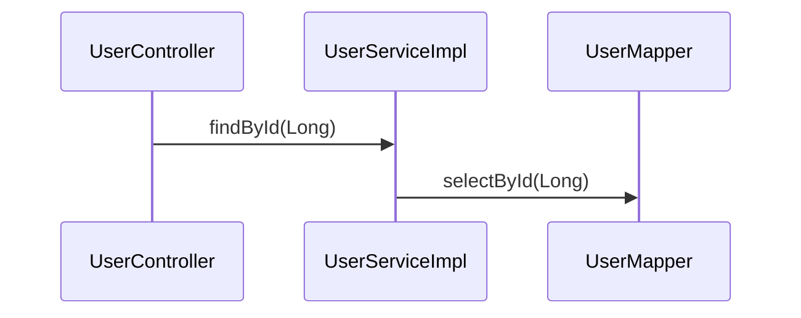

# Feature 1.3 — `render` Command

## Overview

The `render` command is the final stage of the Phase 1 MVP pipeline:

```
index  →  trace  →  render
```

It reads the edge list produced by `trace` (from stdin or a file) and emits a Mermaid
`sequenceDiagram` fenced code block. The output pastes directly into any GitHub/GitLab
Markdown file, VS Code preview, Notion page, or Confluence doc with no external tooling.

Per ADR-003, Mermaid `sequenceDiagram` is the canonical Phase 1 output format.

## CLI

```plain
sourcelens render [--input <file>] [--output <file>]
```

| Option | Short | Required | Default | Description |
| ------ | ----- | -------- | ------- | ----------- |
| `--input` | `-i` | no | stdin | Edge list file from `trace` (or pipe) |
| `--output` | `-o` | no | stdout | Write Mermaid diagram to file |

## Architecture

```plain
RenderCommand    → validates flags, opens reader/writer, parses edges, emits Mermaid block
```

Rendering logic is inlined in `RenderCommand` for prototype speed — see DEBT-009.

## Input Format

One directed edge per line (the `trace` output contract):

```plain
<callerFqn> -> <calleeFqn>
```

Example:

```plain
com.example.controller.UserController#getUser(Long) -> com.example.service.UserServiceImpl#findById(Long)
com.example.service.UserServiceImpl#findById(Long) -> com.example.mapper.UserMapper#selectById(Long)
```

Blank lines and lines that do not contain ` -> ` are silently skipped.

## Output Format

Fenced Mermaid code block:

````plain

````

## FQN → Diagram Mapping

| FQN element | Diagram element | Example |
|-------------|-----------------|---------|
| Class portion of caller FQN | Participant name (from) | `UserController` |
| Class portion of callee FQN | Participant name (to) | `UserServiceImpl` |
| Method portion of callee FQN | Message label | `findById(Long)` |

**Participant name derivation:**
1. Strip everything up to and including the last `.` before `#` → simple class name
2. Replace `$` and `:` with `_` (Mermaid does not allow these in participant identifiers)

Examples:
| FQN class portion | Participant name |
|-------------------|-----------------|
| `com.example.UserController` | `UserController` |
| `com.example.UserSorter$ByUsername` | `UserSorter_ByUsername` |
| `com.example.UserSorter$anonymous:22` | `UserSorter_anonymous_22` |

Participants are declared once, in order of first appearance.

## Known Debt

| ID | Description |
| -- | ----------- |
| DEBT-008 | Simple class name used as participant identifier — two classes with the same simple name in different packages would collide; use aliased FQN in hardening |
| DEBT-009 | No `RenderService` interface — rendering logic is inlined in `RenderCommand`; extract in hardening |

## Verification

```bash
# Build
./mvnw clean package

# Full pipeline — pipe trace directly into render
java -jar target/sourcelens.jar trace \
  --entry "com.example.controller.UserController#getUser(Long)" \
  --db db/mybatis.db | \
  java -jar target/sourcelens.jar render

# Expected stdout:
# ```mermaid
# sequenceDiagram
#     participant UserController
#     participant UserServiceImpl
#     participant UserMapper
#     UserController->>UserServiceImpl: findById(Long)
#     UserServiceImpl->>UserMapper: selectById(Long)
# ```

# Via intermediate files
java -jar target/sourcelens.jar trace \
  --entry "com.example.controller.UserController#getUser(Long)" \
  --db db/mybatis.db \
  --output /tmp/trace.txt

java -jar target/sourcelens.jar render \
  --input /tmp/trace.txt \
  --output /tmp/diagram.md

cat /tmp/diagram.md

# Error case — input file does not exist
java -jar target/sourcelens.jar render --input /nonexistent.txt
# Expected: error "Input file not found: ..."
```
