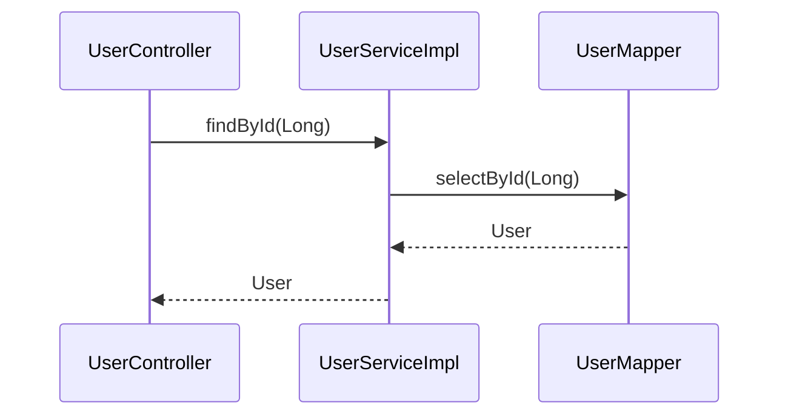

# Feature 2.6 — Method Return Arrows in Mermaid Diagrams

## Overview

Feature 2.6 enriches the generated Mermaid `sequenceDiagram` with dashed return arrows
(`-->>`) that show the return type flowing back from callee to caller.

Before 2.6 a diagram showed only the forward call direction:

```
UserController->>UserServiceImpl: findById(Long)
UserServiceImpl->>UserMapper: selectById(Long)
```

After 2.6 the diagram also includes return arrows in reverse call order:

```
UserController->>UserServiceImpl: findById(Long)
UserServiceImpl->>UserMapper: selectById(Long)
UserMapper-->>UserServiceImpl: User
UserServiceImpl-->>UserController: User
```

`void` return types and unresolvable return types (external-library callees) are silently
suppressed — their absence implies void/irrelevant.

---

## CLI

No new flags.  Return arrows are emitted automatically whenever return-type information is
present in the trace file.  To suppress them, produce the trace file with an older version
of the tool (which omits the ` : ReturnType` suffix).

---

## Design

### Schema change — `method_node.return_type`

A new nullable column is added to `method_node`:

```sql
ALTER TABLE method_node ADD COLUMN return_type TEXT;
```

`CallGraphDb.init()` issues this migration statement every startup and silently ignores the
"duplicate column" error that SQLite raises when the column already exists (i.e. the DB was
created at or after Feature 2.6).  **Existing databases are therefore automatically
migrated** on the next `index` run with no user action required.

### Indexer — return type extraction

`SourceIndexer.CallEdgeVisitor` was previously `VoidVisitorAdapter<String>` passing only
the caller FQN as visitor context.  It is now `VoidVisitorAdapter<String[]>` where the
context carries `[callerFqn, returnType]`.  The return type is extracted directly from
`MethodDeclaration.getType().asString()` (e.g. `"User"`, `"void"`, `"List<String>"`).

Edges are stored as 3-element arrays: `[callerFqn, calleeFqn, callerReturnType]`.

`CallGraphDb.upsertNode` is upgraded from `INSERT OR IGNORE` to a proper UPSERT:

```sql
INSERT INTO method_node(fqn, return_type) VALUES(?, ?)
ON CONFLICT(fqn) DO UPDATE
    SET return_type = excluded.return_type
  WHERE excluded.return_type IS NOT NULL
```

This ensures:
- A callee node first inserted without a return type (because only the caller was being
  indexed at the time) is later updated when its own class file is processed.
- A non-null return type is never overwritten by a `null` insert (order-independent).

### Trace file format — optional ` : ReturnType` suffix

Each call edge in the trace file may now carry the callee's return type:

```
com.example.controller.UserController#getUser(Long) -> com.example.service.UserServiceImpl#findById(Long) : User
com.example.service.UserServiceImpl#findById(Long) -> com.example.mapper.UserMapper#selectById(Long) : User
```

The suffix is emitted by `TraceCommand` via `CallGraphDb.getReturnType(calleeFqn)`.  If
the callee's return type is unknown (null in the DB) no suffix is appended, keeping the
format backward compatible — `render` treats a missing suffix as `returnType = null`.

The separator ` : ` (space-colon-space) is unambiguous: Java method FQNs do not contain
this sequence.

### Render — two-pass diagram generation

`RenderCommand.writeDiagram` now uses an `Edge` record:

```java
private record Edge(String callerFqn, String calleeFqn, String returnType) {}
```

Pass 1 — forward call arrows (unchanged behaviour):
```
from->>to: method(Params)
```

Pass 2 — return arrows in reversed edge order:
```
to-->>from: ReturnType
```

`void`, empty, and null return types are skipped in pass 2.

---

## Output example (mybatis-sample fixture)

```
$ sourcelens trace \
    --entry "com.example.controller.UserController#getUser(Long)" \
    --db db/mybatis.db | \
  sourcelens render
```



---

## Verification

```bash
# Re-index (picks up the new return_type column)
java -jar target/sourcelens.jar index \
  --source test-fixtures/mybatis-sample/src \
  --db db/mybatis.db

# Forward trace with returns
java -jar target/sourcelens.jar trace \
  --entry "com.example.controller.UserController#getUser(Long)" \
  --db db/mybatis.db \
  --output trace.txt

cat trace.txt
# com.example.controller.UserController#getUser(Long) -> com.example.service.UserServiceImpl#findById(Long) : User
# com.example.service.UserServiceImpl#findById(Long) -> com.example.mapper.UserMapper#selectById(Long) : User

java -jar target/sourcelens.jar render --input trace.txt

# Run tests
./mvnw test
# Expected: Tests run: 8, Failures: 0, Errors: 0, Skipped: 0
```

---

## Known limitations

- Generic return types (e.g. `List<User>`, `Map<String, Long>`) are stored and rendered
  as-is.  Most Mermaid renderers handle angle brackets in labels correctly, but some
  legacy renderers may misparse `<>`.  If this is a problem, a sanitization step can be
  added as a hardening debt item.
- External-library callees (unresolved by JavaParser) have no return type in the DB and
  produce no return arrow.  This is acceptable because those edges already degrade
  gracefully (DEBT-002).
